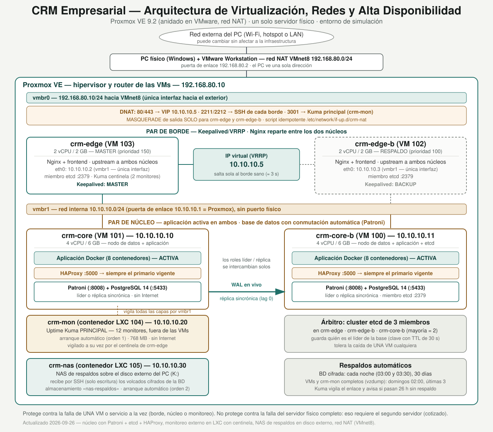

# CRM Empresarial

Sistema de gestión interna (empleados, calendario, inventario, reservas, chat) para una
pyme chilena, construido como microservicios con FastAPI + PostgreSQL + Docker, detrás de
un gateway Nginx. En producción corre virtualizado sobre Proxmox con un diseño de
redundancia — no solo un `docker compose up` en un laptop.

Desarrollado por **César Manríquez Figueroa** ([arkno1820@gmail.com](mailto:arkno1820@gmail.com)).

## Qué incluye

- 6 microservicios de negocio + gateway, patrón *database per service* (una base de datos
  por servicio sobre una única instancia PostgreSQL).
- HTTPS en el gateway y el frontend (certificados propios).
- RBAC granular por módulo, incluyendo un permiso separado para datos de salud de
  empleados.
- Cifrado a nivel de campo para datos sensibles, consentimiento informado y política de
  anonimización (no borrado) — cumplimiento Ley 21.719.
- Auditoría de accesos, exportable para revisión administrativa.
- Chat interno tipo mensajería, con aviso legal de monitoreo y persistencia de 30 días
  para usuarios regulares (permanente para auditoría de administración).
- Sistema de respaldo ante desastres documentado paso a paso (`scripts/`).

## Arquitectura

| Servicio     | Puerto directo | Ruta vía gateway     | Base de datos    |
|--------------|----------------|-----------------------|------------------|
| Auth         | 8001           | `/api/auth/`          | `auth_db`        |
| Empleados    | 8002           | `/api/empleados/`     | `empleados_db`   |
| Calendario   | 8003           | `/api/calendario/`    | `calendario_db`  |
| Inventario   | 8004           | `/api/inventario/`    | `inventario_db`  |
| Reservas     | 8005           | `/api/reservas/`      | `reservas_db`    |
| Chat         | 8006           | `/api/chat/`          | `chat_db`        |
| **Gateway**  | 8080 / **8443 (HTTPS)** | —             | —                |
| **Frontend** | 3000 / **3443 (HTTPS)** | —             | —                |

## Despliegue en producción: Proxmox, no solo Docker Compose

El CRM real de la empresa no vive en un contenedor suelto — corre virtualizado sobre
Proxmox, con un diseño pensado para tolerar fallas de software sin caerse entero:



- **`crm-edge`** (borde, expuesto a la LAN) + **`crm-edge-b`**: par redundante con
  Keepalived/VRRP — una IP virtual salta automáticamente al nodo sano.
- **`crm-core`** (núcleo, aislado en una red interna sin salida a Internet) +
  **`crm-core-b`**: réplica de Postgres cada 15 minutos, con promoción manual
  documentada ante falla.

Guías paso a paso: [`infra/proxmox-terraform/`](infra/proxmox-terraform) (Terraform, crea
las 4 VMs y la red) e [`infra/ansible/`](infra/ansible) (configura Nginx, Docker, Keepalived
y la réplica). El porqué de cada decisión de arquitectura —incluyendo qué protege esta
redundancia y qué no— está en
[`docs/practica-profesional/sintesis-justificacion-academica.md`](docs/practica-profesional/sintesis-justificacion-academica.md).

## Desarrollo local (Docker Compose)

Para levantar todo en tu propia máquina, sin Proxmox:

```bash
cd crm-empresarial
cp .env.example .env    # cambia JWT_SECRET y las contraseñas antes de producción
docker compose up --build
```

Espera a que todos los contenedores estén healthy. La primera vez, Postgres ejecutará
`init-db/init-multiple-dbs.sh` para crear las 6 bases de datos.

Abre **http://localhost:3000** (o `https://localhost:3443` si aceptaste el certificado
propio) — es la interfaz de uso diario del equipo. El primer arranque crea automáticamente
un único usuario administrador con las credenciales de tu `.env`:

```
ADMIN_USERNAME=admin
ADMIN_EMAIL=admin@tuempresa.com
ADMIN_PASSWORD=CambiaEstaClave123
```

Desde el módulo **"Usuarios"** (solo visible para `admin`) das de alta al resto del
equipo, asignando rol y módulos permitidos a cada persona.

Si necesitas resetear todo:

```bash
docker compose down -v
docker compose up --build
```

## Documentación interactiva de cada servicio

FastAPI genera Swagger automáticamente en `http://localhost:<puerto>/docs` para cada
microservicio (ver tabla de puertos arriba).

## Comandos útiles

```bash
docker compose logs -f empleados-service          # ver logs de un servicio
docker compose up --build empleados-service       # reconstruir solo uno
docker compose down                                # parar todo
docker compose down -v                             # parar y borrar los datos
```

## Documentación adicional

- [`scripts/INSTRUCCIONES_RESPALDO.txt`](scripts/INSTRUCCIONES_RESPALDO.txt) — la
  "biblia": qué es el sistema, cómo respaldarlo y cómo recuperarlo por completo ante un
  desastre.
- [`legal/`](legal) — registro de actividades de tratamiento y procedimiento de brechas
  de seguridad (Ley 21.719), con caveat de que no reemplazan asesoría legal.
- [`docs/practica-profesional/`](docs/practica-profesional) — cómo este proyecto se
  conecta con las competencias de Ingeniería en Conectividad y Redes, decisiones de
  arquitectura y su justificación, bitácora de incidentes reales.

## Estructura del proyecto

```
crm-empresarial/
├── docker-compose.yml
├── arquitectura_crm_proxmox.svg
├── gateway/                  # Nginx: proxy reverso + HTTPS
│   ├── nginx.conf
│   └── locations.conf
├── frontend/                 # SPA en JS plano, servida por Nginx
├── init-db/
├── services/
│   ├── auth/
│   ├── empleados/            # incluye cifrado de datos sensibles + auditoría
│   ├── calendario/
│   ├── inventario/
│   ├── reservas/
│   └── chat/
├── infra/
│   ├── proxmox-terraform/    # crea las 4 VMs y la red interna
│   └── ansible/              # configura cada VM (Nginx, Docker, Keepalived, réplica)
├── scripts/                  # respaldo y recuperación ante desastres
├── legal/                    # cumplimiento Ley 21.719
└── docs/
    └── practica-profesional/ # justificación académica del proyecto
```
